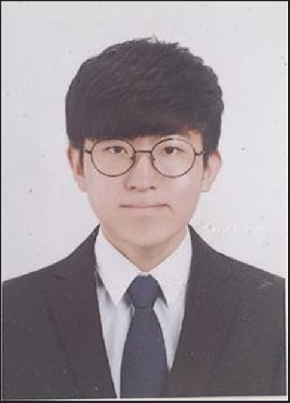

## 프로젝트 소개

### 전기 전자 소자 인식 장치, KNU_Searching Devices

학교 실험실에서 처음 보는 소자를 접했을 때 소자의 정보를 검색하는 시간과 정보 정리에 쓰는 시간을 단축하고자 생성 계획, 앱을 실행하여 소자의 종류(저항, 가변저항, 커패시터, 인덕터, IC칩)를 선택한 후 휴대폰의 후면 카메라로 소자를 촬영하면 소자에 대한 정리된 정보를 알려줌

---

## 개발 환경 및 라이브러리

- HTML5
- JavaScript
- Teachable Machine

---

## App Description + Screenshot

1. 스플래시 화면  
   

2. 초기 화면(메인 화면)
- 소자 인식 장치 상단의 소자별 카테고리 존재
- 카테고리 종류 : Resistance, Variable Resistance, Capacitor, Inductor, IC devices
- 각 소자 인식이 끝나면 Reset 버튼으로 초기화  
  

3. 각 소자 인식 화면
- Resistance : 인식한 소자에 따른 ahm, capacity, error 표시  
  
- Variable Resistance :  
  
- Capacitor :  
  
- Inductor :  
  
- IC devices : 인식한 소자에 따른 데이터 시트와 소자이름과 type  
  

---

## 팀 소개

**KNU_ETX**

| 이름   | 정연준                                                                             | 장은영                                                                             | 최희진                                                                             |
| ------ | ---------------------------------------------------------------------------------- | ---------------------------------------------------------------------------------- | ---------------------------------------------------------------------------------- |
|        | 

 | 

 | 

 |
|        | 팀장                                                                               | 팀원                                                                               | 팀원                                                                               |
| 역할   | PM, 개발                                                                           | 개발, 소자 데이터 수집, 앱 기능 영상 촬영 및 편집, 기능 소개                           |  개발, 소자 데이터 수집, 신청서류 작성 및 자료 정리, 아이디어 제공                      |
| 기여도 | 40%                                                                                | 30%                                                                                | 30%                                                                                |

## 제안서 상의 기능별 개발 여부 및 개발 담당자

| 이름 | 정연준                             | 장은영                        | 최희진                           |
| ---- | ---------------------------------- | ----------------------------- | -------------------------------- |
|      | 각 소자 버튼에 맞는 함수 생성      | 각 소자에 맞는 json 파일 생성 | teachable muchine으로 model 학습 |
|      | 카메라 기능 구현                   | 소자에 대한 변수 지정         | 학습된 model들 불러와 수정       |
|      | 학습된 모델과 비교하여 출력부 완성 | json 파일들 불러오기          |                                  |

---

## 프로그램 설치 URL (데모 앱 다운로드 링크)

[구글드라이브](https://drive.google.com/drive/folders/1QztO9cBt-DbEMAD4O0nkm5--Hy21n46N?usp=share_link)

## 데모 영상

[youtube](https://youtu.be/3a5JKWZjEsM)

---

## 라이센스

[경북대학교](https://www.knu.ac.kr/wbbs/wbbs/main/main.action)
